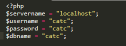
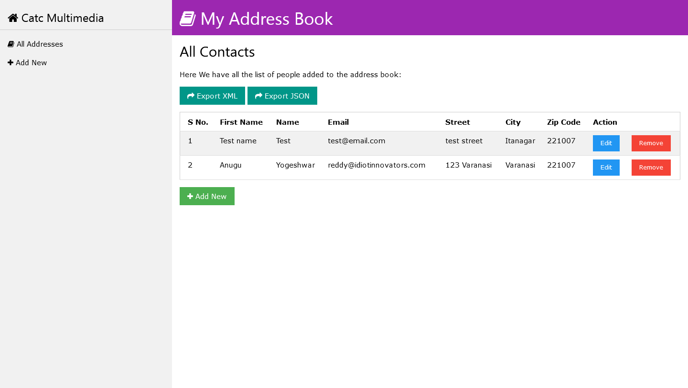
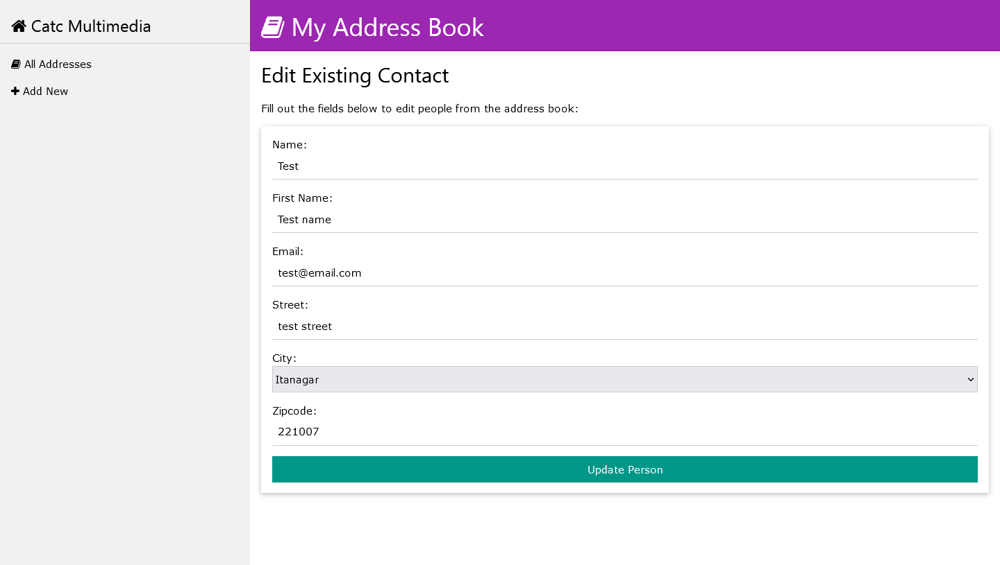

Simple Address Book in PHP & MySQL

1.	Please change the server credentials in the file: db.php
 
2.	default database name is: catc
3.	catc database contains 2 tables: addressbook and city
4.	SQL file is provided with name catc.sql  (this file consists complete db structure and demo data and only needs to be imported)
5.	php files need to be placed in the root of the project after database is setup and everything is live !

SCREENSHOTS
 
Main Page: index.php

Add New Person Page: add.php

 
Edit Contact Page: edit.php

